# 🛰 Gravity Radar v2.0 : Cross-Market ML-Driven Predictor


## 📌 Executive Summary

**Gravity Radar v2.0** 是一套专为极客量化交易员设计的跨国动能传导监控系统。
本系统基于“跨市场重力传导”理论 (US -> KR -> ML -> CN)，利用中美韩三大半导体市场的交易时差与物理特征隔离机制，捕捉全球供应链定价权的转移势能。通过高频拉取三地底层盘口切片，喂入预训练的 Random Forest 矩阵，系统能够在 A 股集合竞价与早盘阶段，极其敏锐地发现并输出 5 大 AI 核心生态链（设计、制造、封装、服务器、连接器）的 Alpha 交易信号。

---

## 🏗 Core Architecture

系统采用 FastAPI 作为异步核心，通过隔离的守护协程轮询数据，并依赖单例 `aiohttp.ClientSession` 提供无阻塞的 WebSocket 数据流。

```mermaid
graph TD
    subgraph Data Layer
        A1["Tencent Finance API (US/CN)"] -->|Async GET| B["In-Memory Cache"]
        A2["YFinance (KR)"] -->|Polling Daemon| B
    end

    subgraph Feature Engineering
        B --> C["Dynamic Sector Aggregation"]
        C -->|Sum / Mean| D["Adaptive Feature Alignment"]
    end

    subgraph ML Inference Pipeline
        D -->|DataFrame| E["Random Forest Matrix (5 Sectors)"]
        E -->|predict_proba| F["Conviction Thresholding"]
    end

    subgraph Presentation
        F -->|JSON Payload| G["WebSocket Broadcaster (Port 8002)"]
        G --> H["Gravity Radar UI (Bloomberg Terminal Aesthetic)"]
    end

    style A1 fill:#1e1e1e,stroke:#333
    style A2 fill:#1e1e1e,stroke:#333
    style E fill:#003b00,stroke:#00ff41
    style H fill:#0a0a0a,stroke:#ff9900
```



---

## 🔥 Key Engineering Highlights

在将复杂的机器学习流水线接入实盘高频推送时，我们攻克了以下三大工程壁垒：

### 1. Dynamic Sector Aggregation (动态聚合算法)
系统彻底摒弃了以单只股票代表板块的粗糙映射，实现了对全成分股的实时指数合成。
- **Price-Weighted Index**: 将板块内有效股票的绝对价格严格相加，反映核心资产的体量。
- **Equal-Weighted Return**: 计算有效股票的收益率均值，对冲极值波动。
- **Fault Tolerance**: 自动剔除停牌、空值或接口断联的噪点数据，从底层斩断 `Divide-by-Zero` 崩溃隐患。

### 2. OOM Prevention via ML Monkey-Patching (多线程内存防爆)
`sklearn` 的 `RandomForestClassifier` 在初始化时往往伴随 `n_jobs=-1`，但这在 `uvicorn` 的多进程架构与 `asyncio` 环境下会导致极度致命的 **Fork Bomb (进程炸弹)**，引发 `Killed: 9` (OOM)。
在不侵入破坏 `src/model.py` 原有算法的铁律下，我们在 `server.py` 入口处对 `sklearn` 进行了暴力的 Monkey-patch，强制劫持并限制 `n_jobs=1`，配合 OMP/MKL 线程锁，彻底解决了实盘推理时的内存泄漏。

### 3. Adaptive Feature Alignment (自适应特征对齐)
量化实盘最常见的 Bug 即训练特征与实时推流特征的错位（维度或顺序）。
本架构利用 `model.feature_names_in_` 属性，在每次组装 WebSocket 滴答数据时，动态反向提取该板块专属的特征树结构，严格按照 ML 的“原始记忆”装填特征槽。对于非营业时间或丢失的特征，强制以 `fillna(0.0)` 兜底，实现极其强健的无损对接。

### 4. Heterogeneous Data Pipelines (异构数据管道)
针对不同市场的安全封锁与时效要求，构建了错频多源的降维打击网络：
- **US Anchor & CN Target**：采用腾讯财经高速 API (`qt.gtimg.cn`)，实现极速 **【3秒/次】** 的高频轮询，捕捉瞬息万变的买卖压差。
- **KR Momentum**：鉴于 Yahoo Finance 极严的 API 风控与 Rate Limit，我们在独立的 `asyncio` 守护协程中采用原生 `yfinance` 搭配浏览器环境模拟，执行 **【60秒/次】** 的低频防封禁拉取，确保核心动能传导不断流。

### 5. Asymmetric Penalty (非对称惩罚机制)
"PENALTY 5.0x" 并非花哨的 UI 概念，其底层灵魂直接来源于 Random Forest 的 `class_weight={1: 5.0, -1: 5.0, 0: 1.0}`。
**业务内核**：该权重阵列明确告诉模型——对趋势性突破的错判惩罚，是震荡市 (0) 错判的 5 倍！这倒逼 ML 引擎进入极度严苛的判定模式，宁可错过不可做错。因此，只有当动能传导极其明确且胜率突破 **> 65%** 的绝对铁底时，系统才会触发橙色脉冲警报，在源头上斩断了 90% 以上的假突破噪音。

---

## 📟 UI / UX Design

前端面板是对 **Bloomberg Terminal** 极客美学的致敬，专为高压盯盘环境设计。
- **High-Density Terminal**: 纯粹的暗黑背景 `#030303`，使用 monospace 字体 (JetBrains Mono) 对齐所有数字跳动。
- **Neon Indicator**: 极简的 `neon-green` 与 `neon-red` 控制胜率与动量的视觉锚点。
- **Basket Tooltip**: 以极暗的 `10px #555` 灰色字体嵌入板块成分股缩写，在不破坏布局的前提下实现最高密度的信息透传。
- **5.0x Penalty Pulse**: 当且仅当 Random Forest 的叶子节点预测概率 **`≥ 65.0%`** 时，该行板块将被触发物理警报，渲染带有呼吸效应的 Neon-Orange (`#ff9900`) 脉冲边框与高亮徽标。

---

## 🚀 Quick Start

环境要求：`conda` (Python 3.9+)

### 1. 启动虚拟环境
```bash
conda activate quant_env
```

### 2. 清理僵尸端口
如果前置进程残留，请务必先肃清 8002 端口：
```bash
lsof -ti :8002 | xargs kill -9
```

### 3. 点亮雷达核心
```bash
python server.py
```
*(系统将在启动阶段自动扫描 `data/full_dataset.csv` 并预热孵化 5 个板块的 ML 模型矩阵)*

### 4. 接入看板
使用任何现代浏览器，通过 Live Server 或直接打开 `gravity_radar.html`。
等待 WebSocket (ws://localhost:8002/ws/radar) 握手成功后，即可开始实盘监控。
